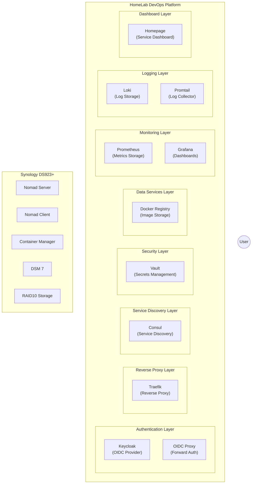

# infra-ds923p-devops
# HomeLab DevOps Platform for Synology DS923+

A comprehensive self-hosted DevOps platform designed specifically for Synology DS923+ NAS with 32GB RAM, enabling personal application development and operations in a home environment.

## Overview

This project provides a modular, script-based approach to setting up a complete DevOps environment using HashiCorp Nomad as the orchestration layer. The platform includes service discovery, reverse proxy with TLS, secrets management, monitoring, logging, container registry, and centralized authentication.

## System Architecture



### Core Components

- **Hardware**: Synology DS923+ with 32GB RAM and 4x4TB HDDs in RAID10
- **Orchestration**: HashiCorp Nomad
- **Service Discovery**: Consul
- **Reverse Proxy**: Traefik with self-signed certificates
- **Secrets Management**: HashiCorp Vault
- **Container Registry**: Docker Registry
- **Monitoring**: Prometheus, Grafana, Node Exporter
- **Logging**: Loki, Promtail
- **Authentication**: Keycloak (OIDC)
- **Dashboard**: Homepage service dashboard

## Prerequisites

This project is implemented in two stages:

- **Stage 0**: Manual setup of the Synology hardware and core software (documented in docs/00-prerequisites.md)
- **Stage 1**: Automated deployment of the DevOps platform components (this documentation)

Before proceeding, ensure you have completed all Stage 0 prerequisites:

- Synology DS923+ with DSM 7.x installed
- 32GB RAM installed and recognized by the system
- 4x4TB HDDs configured in RAID10
- Container Manager package installed
- Nomad installed and running
- SSH enabled with key-based authentication
- Proper firewall configuration
- Directory structure created in /volume1/nomad/

## Installation

### Quick Start

1. Clone this repository:
   ```bash
   git clone https://github.com/yourusername/homelab-devops.git
   cd homelab-devops
   ```

2. Make the main script executable:
   ```bash
   chmod +x install.sh
   ```

3. Run the installation:
   ```bash
   ./install.sh
   ```

4. Access your platform:
   ```
   Dashboard: https://home.homelab.local
   Grafana: https://grafana.homelab.local
   Vault: https://vault.homelab.local
   Registry: https://registry.homelab.local
   ```

### Advanced Installation

For fine-grained control, you can run individual module scripts:

```bash
./scripts/01-setup-directories.sh
./scripts/02-configure-volumes.sh
./scripts/03-deploy-consul.sh
# etc.
```

## Module Documentation

For detailed information about each component, refer to the module-specific documentation:

- [Prerequisites and Stage 0 Setup](docs/00-prerequisites.md)
- [Initial Setup and Directories](docs/01-setup-directories.md)
- [Volume Configuration](docs/02-volume-configuration.md)
- [Consul Service Discovery](docs/03-consul-setup.md)
- [Traefik Reverse Proxy](docs/04-traefik-setup.md)
- [HashiCorp Vault](docs/05-vault-setup.md)
- [Docker Registry](docs/06-registry-setup.md)
- [Monitoring Stack](docs/07-monitoring-setup.md)
- [Logging Stack](docs/08-logging-setup.md)
- [OIDC Authentication](docs/09-oidc-setup.md)
- [Homepage Dashboard](docs/10-homepage-setup.md)

## Synology-Specific Considerations

This platform is specifically designed for Synology DS923+ with the following adaptations:

- Directory structure optimized for Synology volumes
- Self-signed certificates instead of Let's Encrypt
- Synology Container Manager integration
- Memory optimizations for 32GB RAM
- Consul DNS integration with Synology
- Local network security configuration

For detailed Synology-specific considerations, see [Synology Considerations](docs/synology-considerations.md).

## Customization

The platform is fully customizable through environment variables or by editing the configuration files:

- Create `config/custom.conf` to override default settings
- Change hostnames and domain settings
- Adjust resource allocations for services
- Modify service versions and configurations

## Storage Configuration

The platform uses a tiered storage approach on your RAID10 array:

- High-performance storage for databases and metrics
- High-capacity storage for logs and data
- Standard storage for configuration and smaller datasets

For details, see [Storage Configuration](docs/storage-configuration.md).

## Security

The platform implements several security measures:

- Self-signed certificates with local CA
- SSH restricted to local network
- Firewall rules for service access
- OIDC authentication for services
- Secrets management with Vault

## Backup and Recovery

For backup procedures and recovery options, refer to the [Backup Documentation](docs/backup-recovery.md).

## Troubleshooting

Common issues and their solutions are documented in the [Troubleshooting Guide](docs/troubleshooting.md).

## License

This project is released under the MIT License. See the [LICENSE](LICENSE) file for details.