# HomeLab DevOps Platform Architecture for Synology DS923+

The following diagram illustrates the complete architecture of the HomeLab DevOps Platform for Synology DS923+, showing all components, their relationships, and data flows.

```mermaid
flowchart TB
    %% Users and external access
    User((User))
    
    %% Main boundary
    subgraph HomeLab["HomeLab DevOps Platform"]
        %% Authentication Layer
        subgraph AuthLayer["Authentication Layer"]
            Keycloak["Keycloak\n(OIDC Provider)"]
            OIDC["OIDC Proxy\n(Forward Auth)"]
        end
        
        %% Reverse Proxy Layer
        subgraph ProxyLayer["Reverse Proxy Layer"]
            Traefik["Traefik\n(Reverse Proxy)"]
        end
        
        %% Service Discovery Layer
        subgraph DiscoveryLayer["Service Discovery Layer"]
            Consul["Consul\n(Service Discovery)"]
        end
        
        %% Security Layer
        subgraph SecLayer["Security Layer"]
            Vault["Vault\n(Secrets Management)"]
        end
        
        %% Data Layer
        subgraph DataLayer["Data Services Layer"]
            Registry["Docker Registry\n(Image Storage)"]
        end
        
        %% Monitoring Layer
        subgraph MonitoringLayer["Monitoring Layer"]
            Prometheus["Prometheus\n(Metrics Storage)"]
            Grafana["Grafana\n(Dashboards)"]
        end
        
        %% Logging Layer
        subgraph LoggingLayer["Logging Layer"]
            Loki["Loki\n(Log Storage)"]
            Promtail["Promtail\n(Log Collector)"]
        end
        
        %% Dashboard Layer
        subgraph DashLayer["Dashboard Layer"]
            Homepage["Homepage\n(Service Dashboard)"]
        end
    end
    
    %% Synology Infrastructure Layer
    subgraph SynologyDS923["Synology DS923+ (32GB RAM, 4x4TB RAID10)"]
        DSM["DSM 7.x"]
        ContainerManager["Container Manager"]
        Nomad["Nomad"]
        Volume1["Volume1: /volume1/nomad/\n(Storage Classes)"]
        Volume2["Volume2: /volume2/\n(Data & Backups)"]
        Docker["Docker Engine"]
    end
    
    %% External connections
    User -->|"HTTPS\n(Self-signed TLS)"| Traefik
    
    %% Auth connections
    Traefik -->|"Forward Auth"| OIDC
    OIDC -->|"Authenticate"| Keycloak
    
    %% Traefik connections
    Traefik -->|"Routes to"| Keycloak
    Traefik -->|"Routes to"| Grafana
    Traefik -->|"Routes to"| Prometheus
    Traefik -->|"Routes to"| Registry
    Traefik -->|"Routes to"| Loki
    Traefik -->|"Routes to"| Vault
    Traefik -->|"Routes to"| Homepage
    Traefik -->|"Routes to"| Consul
    
    %% Consul connections
    Consul -->|"Service Discovery"| Traefik
    Homepage -->|"Service Discovery"| Consul
    Keycloak -->|"Registers with"| Consul
    OIDC -->|"Registers with"| Consul
    Vault -->|"Registers with"| Consul
    Registry -->|"Registers with"| Consul
    Prometheus -->|"Registers with"| Consul
    Grafana -->|"Registers with"| Consul
    Loki -->|"Registers with"| Consul
    
    %% Auth flows
    Grafana -->|"Authenticates with"| Keycloak
    Vault -->|"Authenticates with"| Keycloak
    
    %% Vault connections
    Keycloak -->|"Retrieves secrets"| Vault
    Grafana -->|"Retrieves secrets"| Vault
    Prometheus -->|"Retrieves secrets"| Vault
    Loki -->|"Retrieves secrets"| Vault
    Registry -->|"Retrieves secrets"| Vault
    
    %% Monitoring connections
    Prometheus -->|"Scrapes metrics"| Consul
    Prometheus -->|"Scrapes metrics"| Registry
    Prometheus -->|"Scrapes metrics"| Keycloak
    Prometheus -->|"Scrapes metrics"| Vault
    Prometheus -->|"Scrapes metrics"| Traefik
    Prometheus -->|"Scrapes metrics"| Loki
    Prometheus -->|"Scrapes metrics"| DSM
    Grafana -->|"Queries"| Prometheus
    Grafana -->|"Queries"| Loki
    
    %% Logging connections
    Promtail -->|"Collects logs"| Keycloak
    Promtail -->|"Collects logs"| Registry
    Promtail -->|"Collects logs"| Vault
    Promtail -->|"Collects logs"| Traefik
    Promtail -->|"Collects logs"| DSM
    Promtail -->|"Sends logs"| Loki
    
    %% Infrastructure connections
    HomeLab -->|"Runs on"| Nomad
    Nomad -->|"Uses"| Docker
    Nomad -->|"Uses"| ContainerManager
    Docker -->|"Stores container images"| ContainerManager
    HomeLab -->|"Stores service data in"| Volume1
    HomeLab -->|"Stores backups in"| Volume2
    
    %% Storage Classes
    subgraph StorageClasses["Storage Classes in Volume1"]
        HighPerf["high_performance\n(Consul, Vault, Prometheus)"]
        HighCap["high_capacity\n(Loki, Registry)"]
        Standard["standard\n(Keycloak, Grafana, Homepage)"]
    end
    
    Volume1 --- StorageClasses
    
    %% Styling
    classDef auth fill:#EFEFFF,stroke:#000,stroke-width:2px
    classDef proxy fill:#F8F8F8,stroke:#000,stroke-width:2px
    classDef discovery fill:#FFFFDE,stroke:#000,stroke-width:2px
    classDef security fill:#FFE6E6,stroke:#000,stroke-width:2px
    classDef data fill:#E6FFE6,stroke:#000,stroke-width:2px
    classDef monitoring fill:#FFE6E6,stroke:#000,stroke-width:2px
    classDef logging fill:#E6E6FF,stroke:#000,stroke-width:2px
    classDef dashboard fill:#FFE6FF,stroke:#000,stroke-width:2px
    classDef synology fill:#F0F0F0,stroke:#000,stroke-width:2px
    classDef storage fill:#E6F9FF,stroke:#000,stroke-width:2px
    class User user
    class Keycloak,OIDC auth
    class Traefik proxy
    class Consul discovery
    class Vault security
    class Registry data
    class Prometheus,Grafana monitoring
    class Loki,Promtail logging
    class Homepage dashboard
    class DSM,ContainerManager,Nomad,Volume1,Volume2,Docker synology
    class HighPerf,HighCap,Standard storage
```

## Component Descriptions

### Authentication Layer
- **Keycloak**: OIDC provider for centralized authentication
- **OIDC Proxy**: Forward authentication proxy for services that don't natively support OIDC

### Reverse Proxy Layer
- **Traefik**: Edge router handling all incoming traffic and service routing with self-signed certificates

### Service Discovery
- **Consul**: Service registry and health checks for all components

### Security Layer
- **Vault**: Secrets management, credential storage, and sensitive configuration

### Data Services
- **Docker Registry**: Private container image repository

### Monitoring
- **Prometheus**: Time-series database collecting metrics from all services
- **Grafana**: Visualization platform for metrics and logs

### Logging
- **Loki**: Log aggregation system storing logs from all services
- **Promtail**: Log collector that forwards logs to Loki

### Dashboard
- **Homepage**: Central dashboard for accessing all platform services

### Synology Infrastructure
- **DSM 7.x**: Synology's operating system
- **Container Manager**: Synology's Docker management package
- **Nomad**: Container orchestration platform
- **Docker Engine**: Container runtime
- **Volume1**: Primary storage volume for service data
- **Volume2**: Secondary storage volume for data and backups

### Storage Classes
- **high_performance**: Optimized for services requiring fast I/O (databases, key-value stores)
- **high_capacity**: Optimized for services requiring larger storage (logs, registry)
- **standard**: General purpose storage for configuration and smaller services

## Data Flows

1. **User Access Flow**: Users access services through Traefik reverse proxy with self-signed certificates
2. **Authentication Flow**: Services authenticate users against Keycloak OIDC
3. **Service Discovery Flow**: All services register with Consul
4. **Secret Management Flow**: Services retrieve sensitive configuration from Vault
5. **Monitoring Flow**: Prometheus collects metrics, Grafana visualizes them
6. **Logging Flow**: Promtail collects logs, forwards to Loki, viewed in Grafana
7. **Dashboard Flow**: Homepage discovers services via Consul for display

## Hardware Specifications

This architecture is specifically designed for the Synology DS923+ with:
- 32GB RAM (upgraded from stock 8GB)
- 4x 4TB HDDs in RAID10 configuration (8TB usable space)
- AMD Ryzen R1600 dual-core processor
- DSM 7.x operating system

The platform is designed to fit within the resource constraints while providing a complete DevOps environment.

## Network Considerations

- All services are accessible via internal network (10.0.4.0/24)
- No external ports are exposed to the internet
- Self-signed certificates are used for internal TLS
- Local DNS resolution via hosts file or internal DNS server

## Memory Allocation

The services are allocated appropriate memory based on the 32GB available:
- Prometheus: 4GB
- Loki: 3GB
- Keycloak: 2GB
- Vault: 1GB
- Grafana: 1GB
- Consul: 1GB
- Other services: 0.5GB or less each

This allocation ensures stability while maximizing resource utilization for the most demanding services.